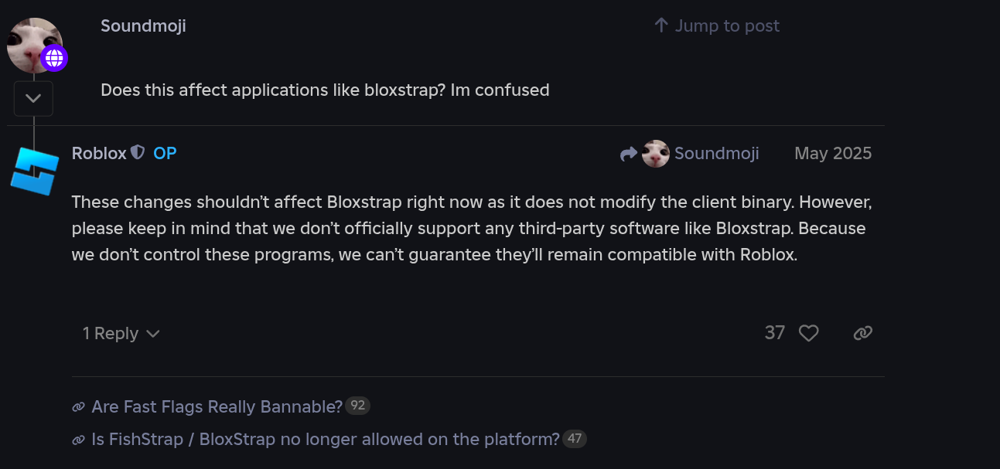

import { Card } from "@astrojs/starlight/components";

<Card title="Is fishstrap.com an official website?" icon="warning">
  **No, fishstrap.com is not the official website.** Fishstrap's only official
  website is [fishstrap.app][main], whose top-level domain is `.app`. This Wiki
  is available at [wiki.fishstrap.app][wiki], a subdomain of fishstrap.app.
</Card>

<Card title="Where can I download Fishstrap?" icon="download">
  Official sources to download Fishstrap from are the [GitHub
  repository][gh-repo] and the official website. We also have a self-hosted
  Forgejo instance with [a repository mirror][fishjo-repo] (it is source code
  only). Any other websites offering downloads and/or claiming to be us are not
  controlled by us, do not download from them.
</Card>

<Card title="Is Fishstrap malware?" icon="information">
  **Fishstrap is not malware, never was, and never will be.** It is free and
  open-source software with its source code available for everyone to read at
  our [GitHub][gh-repo] and [Forgejo][fishjo-repo] repositories. Antiviruses may
  falsely flag new versions of Fishstrap as malware (which is common for FOSS),
  but rest assured they aren't.
</Card>

<Card title="Could Fishstrap get me banned?" icon="information">
  No, and it is not possible for Fishstrap to get you banned. It does not modify
  the client binary in any way that could get your Roblox account banned or
  terminated.

  :::note
  Replacing default textures and/or sounds with your own does not qualify as
  having [a modified client the way Roblox defines it][devforum-1], as those
  assets are stored as separate files and are not embedded into the client.
  :::

  
</Card>

<Card title="Would Fishstrap increase my FPS/reduce my ping?" icon="close">
  Fishstrap wouldn't increase your FPS nor would it reduce your latency to
  Roblox servers. Consider upgrading your PC for more performance and/or
  upgrading your network plan or moving closer to Roblox servers for less
  latency.
</Card>

<Card title="My FastFlags don't work anymore!" icon="warning">
  Roblox has implemented an allowlist of FastFlags for the client (the one you
  use to play games). This means you can't use FastFlags that were not approved
  by Roblox. See the allowlist in [this Devforum post][devforum-2].

  :::danger
  Avoid programs that claim to let you use custom FastFlags! They will likely
  get you hacked or banned.
  :::
</Card>

<Card title="Where can I find mods?" icon="magnifier">
  You can find user-submitted mods on [Fishstrap] or [Bloxstrap] Discord
  servers. [GameBanana] also has something to offer.
</Card>

<Card title="My issue is undocumented. Where can I report it?" icon="document">
  [Join our Discord server][Fishstrap] or [create an issue on GitHub][gh-repo]
  for further support.
</Card>

[main]: https://www.fishstrap.app
[wiki]: https://wiki.fishstrap.app

[gh-repo]: https://github.com/fishstrap/fishstrap
[fishjo-repo]: https://git.fishstrap.app/fishstrap/fishstrap

[Fishstrap]: https://discord.gg/dZJSbgHx8y
[Bloxstrap]: https://discord.gg/nKjV3mGq6R

[devforum-1]: https://devforum.roblox.com/t/an-update-on-automated-action-against-modified-clients/3640609
[devforum-2]: https://devforum.roblox.com/t/allowlist-for-local-client-configuration-via-fast-flags/3966569

[GameBanana]: https://gamebanana.com/games/2879
